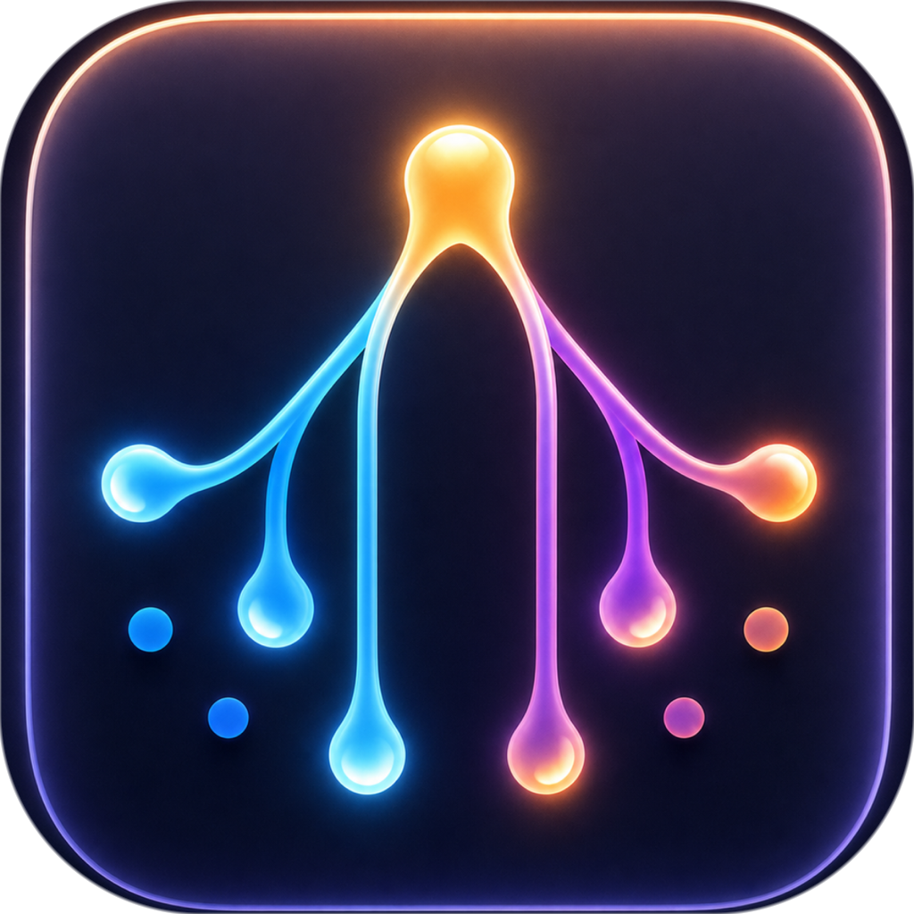

<div align="center">



# myFlowForge

**Forge your AI coding workflow.**

A desktop cockpit that orchestrates **Claude Code, Codex, Cursor, Gemini, qoder & opencode** into one governed, multi‑stage coding pipeline — with plan‑approval gates, native session import, live usage tracking, MCP integration, and a desktop pet to keep you company.

[](LICENSE)


**English** · [简体中文](README.zh-CN.md) · [日本語](README.ja.md)

</div>

---

## What is myFlowForge?

Modern AI coding tools each live in their own terminal, with their own session state, their own quota, and no shared plan. **myFlowForge** puts them all under one roof and turns "chatting with an AI" into a **repeatable, reviewable engineering workflow**.

You describe what you want. Forge drives your chosen agents through a staged pipeline — **Requirement → Design → Develop → Test → Review** — pausing at a **hard gate** so you can approve the technical plan *before* a single line of code is written. Every stage can run a different agent and model, in parallel across multiple projects, while a friendly desktop pet shows you what's happening at a glance.

> ⚠️ **Project status:** myFlowForge is an actively developed personal project. It currently targets **macOS** (Apple Silicon & Intel). Being Electron‑based, it can be built for other platforms from source, but only macOS is packaged today.

## ✨ Highlights

- **🎛️ Multi‑agent orchestration** — Route each workflow stage to a different coding CLI (Claude Code, Codex, Cursor, Gemini, qoder, opencode) and a different model. **opencode** is itself a multi‑provider gateway — connect it once to reach many model vendors.
- **📂 Open in your editor** — A titlebar "Open location" button detects installed editors (VS Code, Cursor, JetBrains, Zed, Finder, terminals…) and opens the current workspace — or the file you're previewing — in your pick, remembered as the default.
- **⌨️ Chat slash commands** — Type `/` in chat for a menu of workflow triggers plus your **real on‑disk commands/prompts and installed skills**, filtered per agent.
- **🔄 Governed multi‑stage pipeline** — Requirement → Design → Develop → Test → Review, with a **hard plan‑approval gate**: review and approve (or reject) the technical design before execution begins.
- **✂️ Selective, token‑efficient execution** — A configured workflow no longer forces every task through all stages across all projects. Describe a small task in plain language and the orchestrating agent proposes a **trimmed plan** — run only the stages you need (e.g. skip Test/Review) and scope each stage to a subset of projects (e.g. analyze all five, write code in only two). The approval card shows exactly what will run before you confirm.
- **🧭 Orchestrator, not executor** — The main chat agent never writes code or spawns its own internal sub‑agents; it only decomposes tasks and delegates every hands‑on step to Forge's real, orchestrated sub‑agents.
- **🧩 Parallel projects & workspaces** — Run multiple workspaces concurrently, each with isolated git worktrees; watch several agents work side‑by‑side in parallel lanes.
- **📥 Native session import** — Read‑only scan and import your existing local Claude / Codex / Cursor / qoder sessions into a central index, then resume them as workspaces.
- **📊 Live usage & quota tracking** — Real usage adapters surface each provider's remaining quota and reset times.
- **🔌 MCP integration** — A built‑in Forge MCP server bridges agents back into the app (ask questions, propose plans, hand off artifacts) for reliable, tool‑driven control.
- **🖥️ Real‑time observability** — Streaming thinking / execution / file‑change / output logs, a filterable log console, and cross‑project change evidence.
- **🐾 Desktop pet** — A draggable, resizable companion that follows your focus, previews agent activity, and pops up confirmation cards — with configurable effects and multiple pet packs.
- **🎨 Polished, personalizable UI** — Glassmorphism, **6 themes** (light / dark / auto + midnight / sepia / forest), **12 accent colors**, a **custom background image** (whole‑app or chat‑area, with adjustable opacity), a redesigned home dashboard with a live local‑time greeting, resizable panes, and a notification center.

## 🤖 Supported coding agents

| Agent | Chat | Workflow run | Native resume | Models | MCP |
|-------|:----:|:------------:|:-------------:|:------:|:---:|
| **Claude Code** | ✅ | ✅ | ✅ | dynamic | ✅ |
| **Codex** | ✅ | ✅ | ✅ | dynamic | ✅ |
| **Cursor** | ✅ | ✅ | ✅ | dynamic | — |
| **Gemini** | ✅ | ✅ | — | dynamic | — |
| **qoder** | ✅ | ✅ | ✅ | dynamic | ✅ |
| **opencode** | ✅ | ✅ | ✅ | dynamic (multi‑vendor) | — |

> Models are discovered from each CLI's real local configuration — nothing is hard‑coded, and you can edit the model list per provider. **opencode** discovers its models from `opencode models`, so a single integration brings in every provider you've configured in it.

## 🔧 How it works

```
   You describe the goal
            │
            ▼
   📋 Requirement  ──►  🎨 Design  ──►  ✋ PLAN GATE  ──►  💻 Develop  ──►  🧪 Test  ──►  🔍 Review
     (clarify)         (tech plan)     approve / reject      (code)        (verify)     (audit)
            │                                │
            │                                └─ You confirm the plan is correct *before* any code is written
            ▼
   Each stage → your chosen agent + model, isolated git worktree, live streaming logs
```

Three ways to trigger a workflow, all converging on the same single gate:

1. The main chat agent detects intent and calls the **`forge_propose_plan`** MCP tool.
2. A skill‑driven fenced directive as a fallback.
3. The explicit **"Start workflow"** button.

## 📥 Download & install

Grab the latest `.dmg` from the [**Releases**](https://github.com/xzghua/myFlowForge/releases) page:

| Your Mac | Recommended download |
|----------|----------------------|
| Apple Silicon (M1/M2/M3/M4) | `myFlowForge-<version>-arm64.dmg` or the universal build |
| Intel | `myFlowForge-<version>.dmg` (x64) or the universal build |
| Not sure | `myFlowForge-<version>-universal.dmg` — works on both |

> **⚠️ The app is not code‑signed yet.** On first launch macOS may warn that the app *"can't be opened"* or *"is damaged"*. This is expected for an unsigned app. To open it:
> - **Right‑click** the app in `/Applications` → **Open** → **Open** in the dialog, **or**
> - run once in Terminal: `xattr -dr com.apple.quarantine /Applications/myFlowForge.app`
>
> myFlowForge checks this Releases feed for updates and offers newer versions in‑app.

## 🚀 Getting started

### Prerequisites

- **macOS** (Apple Silicon or Intel)
- **Node.js** ≥ 20 and **npm**
- One or more of the supported coding CLIs installed and authenticated (Claude Code, Codex, Cursor, Gemini, qoder). Forge detects what you have and guides you through installing the rest.

### Install & run in development

```bash
# 1. Clone
git clone https://github.com/xzghua/myFlowForge.git
cd myFlowForge

# 2. Install dependencies
npm install

# 3. Launch in dev mode (hot reload)
npm run dev
```

### Useful scripts

| Command | What it does |
|---------|--------------|
| `npm run dev` | Start the app with hot reload |
| `npm test` | Run the full test suite (Vitest) |
| `npm run typecheck` | Type‑check both main & renderer tsconfigs |
| `npm run build` | Build the production bundle |
| `npm run dist` | Build a macOS distributable (`.dmg`) |

### Building a distributable

```bash
npm run dist            # macOS x64
npm run dist:arm64      # Apple Silicon
npm run dist:universal  # Universal binary
```

Artifacts are written to `release/`.

## 🏗️ Tech stack

- **Shell:** [Electron](https://www.electronjs.org/) 42 + [electron‑vite](https://electron-vite.org/)
- **UI:** [React](https://react.dev/) 19 + TypeScript 6
- **Terminal:** [xterm.js](https://xtermjs.org/) + [node‑pty](https://github.com/microsoft/node-pty)
- **Agent bridge:** [Model Context Protocol SDK](https://modelcontextprotocol.io/)
- **Process control:** [execa](https://github.com/sindresorhus/execa) · **Validation:** [zod](https://zod.dev/) · **File watching:** [chokidar](https://github.com/paulmillr/chokidar)
- **Testing:** [Vitest](https://vitest.dev/) + Testing Library (Test‑Driven Development throughout)
- **Packaging:** [electron‑builder](https://www.electron.build/)

## 📁 Project structure

```
src/
├── main/          # Electron main process
│   ├── agents/    # CLI adapters (claude, codex, cursor, gemini, qoder, opencode) + providers
│   ├── orchestrator/  # Workflow engine & stage gating
│   ├── chat/      # Per-workspace chat, queue, memory
│   ├── mcp/       # Forge MCP server (agent → app bridge)
│   ├── pet/       # Desktop pet window
│   ├── sessionImport/  # Native session scanning & import
│   ├── usage/     # Provider quota adapters
│   └── ...        # git, fs, terminal, update, watcher, windows
├── renderer/      # React UI (views, components, pet, settings, theme)
├── preload/       # Context‑isolated IPC bridge
└── shared/        # Types shared across processes
```

## 🤝 Contributing

Contributions, issues, and feature requests are welcome! This project follows a **test‑driven** workflow — please add or update tests with your changes and make sure `npm test` and `npm run typecheck` pass before opening a PR.

## 📄 License

Released under the [MIT License](LICENSE) © 2026 zghua.

## 🙏 Acknowledgements

Built on top of the excellent open‑source ecosystem around Electron, React, Vite, and the Model Context Protocol — and the coding agents it orchestrates: Claude Code, Codex, Cursor, Gemini, and qoder.
